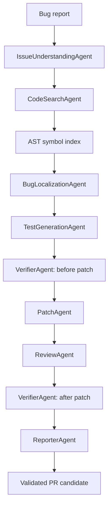
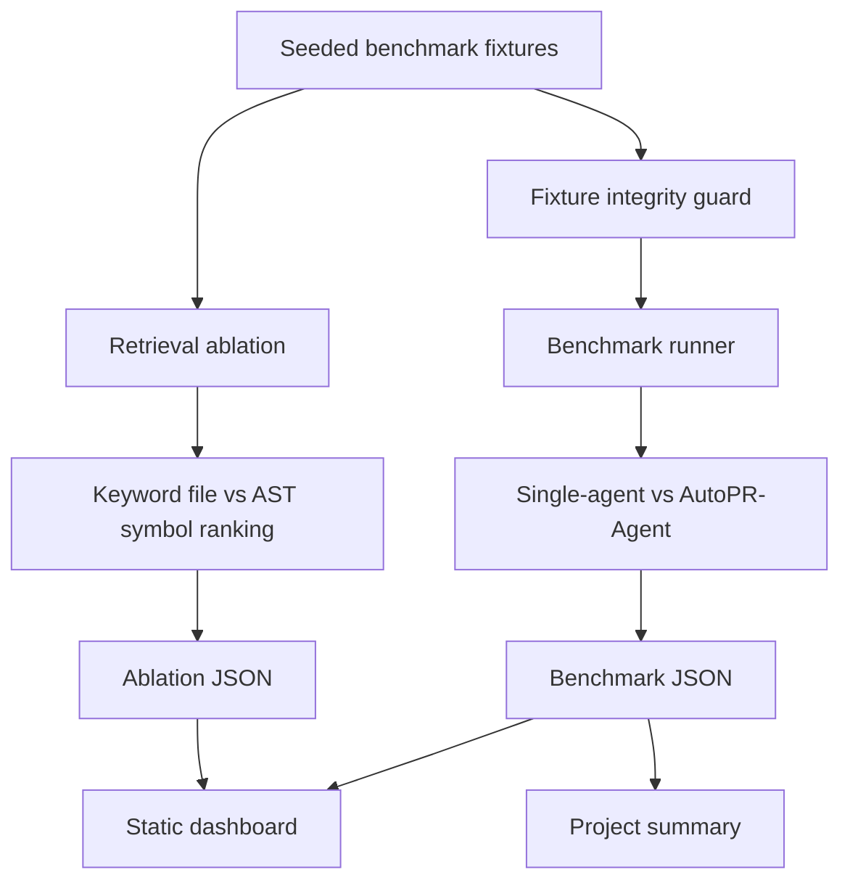

# AutoPR-Agent Architecture

## Agent Repair Flow
AutoPR-Agent decomposes code repair into specialized agents. The core guardrail is the test-first loop: generated regression tests must fail before the patch and pass after the patch.

## Evaluation Flow
The project evaluates both end-to-end repair quality and the retrieval/localization strategy. Reports are saved as JSON and rendered into a static dashboard.

## Key Design Choices
- Keep the default provider local and deterministic for repeatable evaluation.
- Use AST symbol ranking to reduce test-file false positives.
- Require before/after verification for accepted patches.
- Record diffs, review checklists, and run artifacts for auditability.
